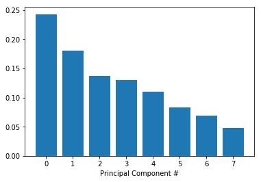
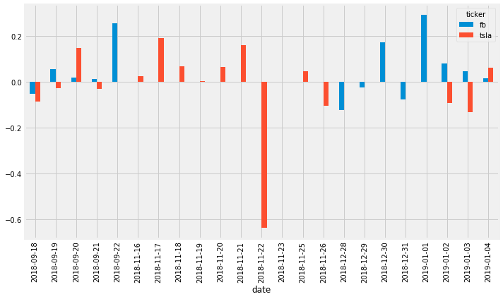

# OEltouny_Portfolio
My Data Science portfolio

# [Project 1: SupervisedMusicPrediction](https://github.com/OmarEltouny78/SupervisedMusicPrediction)

- Using a dataset comprised of songs of two music genres (Hip-Hop and Rock), you will train a classifier to distinguish between the two genres based only on track information derived from Echonest (now part of Spotify). You will first make use of pandas and seaborn packages in Python for subsetting the data, aggregating information, and creating plots when exploring the data for obvious trends or factors you should be aware of when doing machine learning.

- Next, you will use the scikit-learn package to predict whether you can correctly classify a song's genre based on features such as danceability, energy, acousticness, tempo, etc. You will go over implementations of common algorithms such as PCA, logistic regression, decision trees, and so forth.

# [Project 2: Sentiment-Analysis](https://github.com/OmarEltouny78/Sentiment-Analysis)

Data Provided by DataCamp. Extract Sentiment from Stock Headlines from Facebook and Telsa

## Goals to be achieved from project

Getting an understanding of Sentiment Analysis
- Working on real life data
- Applying this social media sites starting with Twitter

# [Project 3: Bad Passwords](https://github.com/OmarEltouny78/Bad_Passwords)

## NLP to detect bad passwords in dataset

- Almost every web service you join will require you to come up with a password. But what makes a good password? In June 2017 the National Institute of Standards and Technology (NIST) published publication 800-63B titled Digital Identity Guidelines: Authentication and Lifecycle Management. This publication doesn't tell you what is a good password, but it does have specific rules for what is a bad password.

- In this project, you will take a list of user passwords and, using publication 800-63B, you will write code that automatically detects and flags the bad passwords.'

# [Project 4: Banking](https://github.com/OmarEltouny78/Banking)

- After a debt has been legally declared "uncollectable" by a bank, the account is considered "charged-off." But that doesn't mean the bank walks away from the debt. They still want to collect some of the money they are owed. The bank will score the account to assess the expected recovery amount, that is, the expected amount that the bank may be able to receive from the customer in the future. This amount is a function of the probability of the customer paying, the total debt, and other factors that impact the ability and willingness to pay.

- The bank has implemented different recovery strategies at different thresholds ($1000, $2000, etc.) where the greater the expected recovery amount, the more effort the bank puts into contacting the customer. For low recovery amounts (Level 0), the bank just adds the customer's contact information to their automatic dialer and emailing system. For higher recovery strategies, the bank incurs more costs as they leverage human resources in more efforts to obtain payments. Each additional level of recovery strategy requires an additional $50 per customer so that customers in the Recovery Strategy Level 1 cost the company $50 more than those in Level 0. Customers in Level 2 cost $50 more than those in Level 1, etc.

- The big question: does the extra amount that is recovered at the higher strategy level exceed the extra $50 in costs? In other words, was there a jump (also called a "discontinuity") of more than $50 in the amount recovered at the higher strategy level? We'll find out in this notebook.

